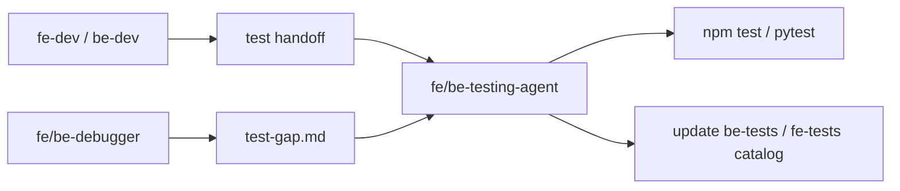

# Test writing

> **Type:** Procedural context (patterns and examples) — **not** a symbol-per-file catalog. Test inventory lives in [be-tests.md](be-tests.md) and [fe-tests.md](fe-tests.md).  
> **Policy:** [`rules-testing.md`](../rules/rules-testing.md) · **Agents:** `fe-testing-agent` / `be-testing-agent` · **Commands:** [`project.profile.yaml`](../project.profile.yaml) → `commands.be_test`, `commands.fe_test`

Colocated unit/integration tests only — Vitest + RTL (FE), pytest + TestClient (BE). No E2E in this PoC.

---

## Test stack

| Layer | Tool | Location | What it tests |
|-------|------|----------|---------------|
| FE unit / integration | Vitest + RTL | `@profile:paths.frontend_root/**/*.test.{ts,tsx}` | Hooks, API clients, components, App |
| BE integration | pytest + TestClient | `@profile:paths.backend_tests/test_*.py` | Routes, services, DB persistence |
| Shared FE setup | — | `src/test-setup.ts` under frontend root | jest-dom + i18n init |

---

## When tests get written (agent flow)



| Trigger | Who writes tests | Priority |
|---------|------------------|----------|
| Dev handoff lists testable behaviors | `fe-testing-agent` / `be-testing-agent` | Cover every handoff row |
| **`test-gap.md`** exists (bug-fix) | Same testing agents | **Mandatory** — every row |
| Handoff says no new exports to test | Orchestrator may fast-complete step | light gate |

---

## How to run

See `@profile:commands.fe_test` and `@profile:commands.be_test` in [`project.profile.yaml`](../project.profile.yaml).

### Frontend

```powershell
cd apps/web-react
npm test
npx vitest run path/to/File.test.tsx
```

### Backend

```powershell
cd apps/api
python -m pytest tests/ -q
python -m pytest tests/test_toggle_state.py -q
```

### After adding tests

1. Run the test command until green
2. Add or update rows in `@profile:context.fe_tests` or `@profile:context.be_tests`

---

## Creating tests — step-by-step (testing agents)

### 1. Determine scope

- If `@profile:artifact.test_gap` exists → read it **first**; implement **every** listed test
- Else read `@profile:artifact.be_test_handoff` or `@profile:artifact.fe_test_handoff`

### 2. Read sources

- Export under test (component, hook, route, service)
- Existing colocated test file (extend) or create sibling
- [`rules-testing.md`](../rules/rules-testing.md), [`rules-i18n.md`](../rules/rules-i18n.md) (FE)
- [`fe-i18n.md`](fe-i18n.md) for locale keys

### 3. Identify behaviors

| Kind | Test |
|------|------|
| API client | fetch/PUT URL/body; error on non-ok |
| Hook | initial load, persist/toggle, error rollback |
| Component | render states, user events, aria/testids |
| Route | status code, JSON body, persistence |
| i18n UI | `i18n.t('namespace:key')` — not hardcoded strings |

### 4. Write tests (AAA)

Every test uses **Arrange → Act → Assert** comments.

### 5. Run until green

Fix failures in test files unless the bug is in production code (hand off to debugger).

### 6. Update catalog

Add row in `@profile:context.be_tests` or `@profile:context.fe_tests` for new test files.

---

## FE patterns (Vitest + RTL)

### API client

```typescript
import { afterEach, describe, expect, it, vi } from 'vitest'
import { fetchToggleState } from './toggleState'

afterEach(() => {
  vi.unstubAllGlobals()
})

describe('toggleState API', () => {
  it('fetchToggleState returns JSON', async () => {
    vi.stubGlobal('fetch', vi.fn().mockResolvedValue({
      ok: true,
      json: async () => ({ value: false }),
    }))
    await expect(fetchToggleState()).resolves.toEqual({ value: false })
  })
})
```

### Hook

```typescript
import { act, renderHook, waitFor } from '@testing-library/react'
import { vi } from 'vitest'
import * as toggleApi from '../api/toggleState'
import { useToggleState } from './useToggleState'

it('persists toggled value', async () => {
  vi.spyOn(toggleApi, 'fetchToggleState').mockResolvedValue({ value: false })
  vi.spyOn(toggleApi, 'saveToggleState').mockResolvedValue({ value: true })

  const { result } = renderHook(() => useToggleState())
  await waitFor(() => expect(result.current.loading).toBe(false))

  await act(async () => {
    await result.current.toggle()
  })

  expect(toggleApi.saveToggleState).toHaveBeenCalledWith(true)
})
```

### Component (with i18n)

```typescript
import { render, screen } from '@testing-library/react'
import userEvent from '@testing-library/user-event'
import i18n from '../../i18n'
import { BaseButton } from './BaseButton'

it('renders true label when value is true', () => {
  render(<BaseButton value={true} onChange={vi.fn()} />)
  expect(screen.getByText(i18n.t('common:toggle.true'))).toBeInTheDocument()
})
```

### Selector priority (RTL)

1. `getByRole` (with accessible name)
2. `getByTestId`
3. `getByText` via `i18n.t(...)`

---

## BE patterns (pytest)

### Route + DB (isolated temp DB)

```python
@pytest.fixture
def client(tmp_path: Path, monkeypatch: pytest.MonkeyPatch):
    db_file = tmp_path / "test.db"
    monkeypatch.setenv("DATABASE_URL", f"sqlite:///{db_file}")
    init_db()
    with TestClient(app) as test_client:
        yield test_client

def test_get_toggle_state_defaults_false(client: TestClient):
    response = client.get("/api/toggle-state")
    assert response.status_code == 200
    assert response.json() == {"value": False}
```

Colocate: `tests/test_<module>.py` covers routes/services in scope.

---

## Regression from debugger (`test-gap.md`)

1. Debugger fills [`test-gap.template.md`](../working/test-gap.template.md)
2. Must include **Why existing tests did not catch this**
3. Testing agent adds each listed test
4. Task not done until test-gap tests pass

---

## Anti-patterns

| Avoid | Do instead |
|-------|------------|
| Hardcoded locale strings in FE assertions | `i18n.t('app:toggle.on')` |
| Tests in `__tests__/` or distant folders | Colocate next to source |
| One test covering many unrelated flows | One behavior per test |
| Skipping test-gap tests | Implement every row |
| Marking step done before test command passes | Run `@profile:commands.*_test` |

---

## Handoff from dev agents

| Lane | Dev writes | Testing agent reads |
|------|------------|---------------------|
| Backend | `be-test-handoff.md` | `be-testing-agent` |
| Frontend | `fe-test-handoff.md` | `fe-testing-agent` |

Full-stack: **BE handoff → be-testing → FE handoff → fe-testing** (separate files).

---

## Catalogs (reference)

- [`fe-tests.md`](fe-tests.md)
- [`be-tests.md`](be-tests.md)
